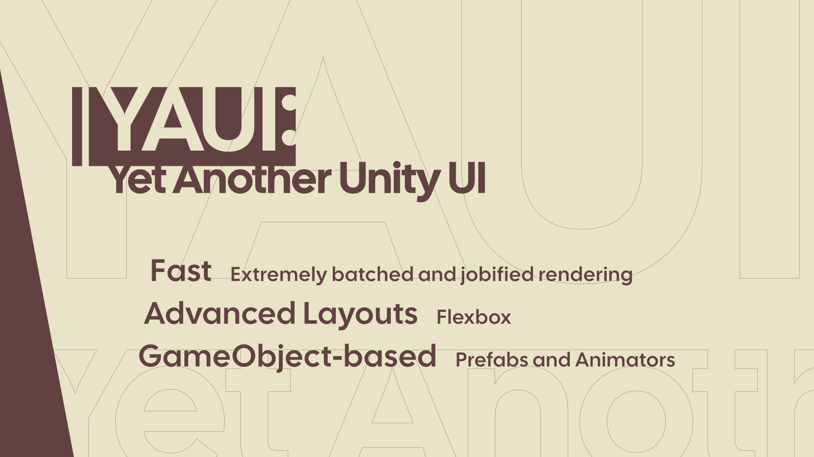
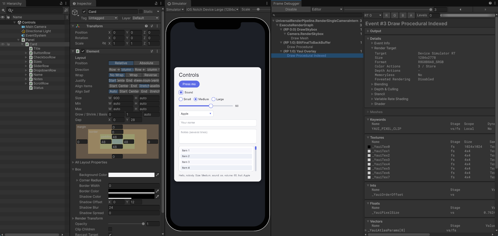
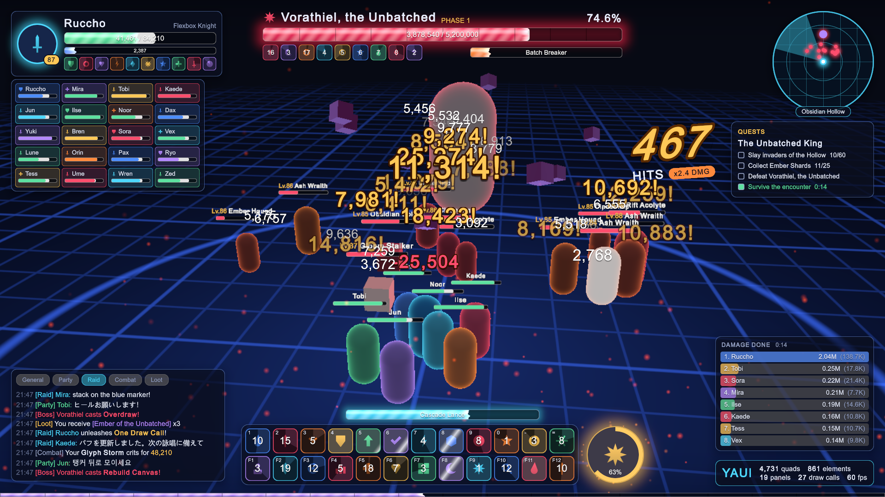
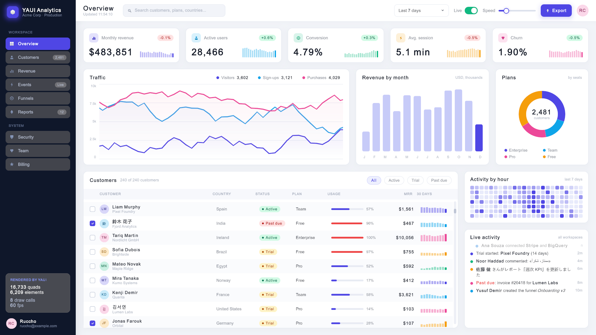
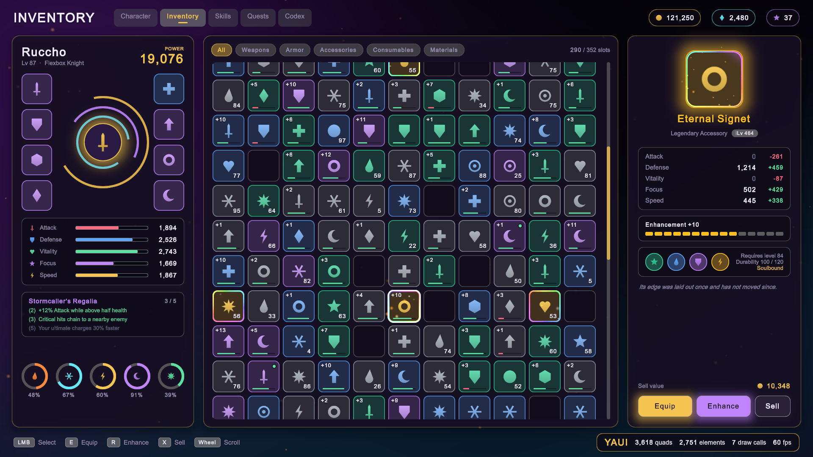
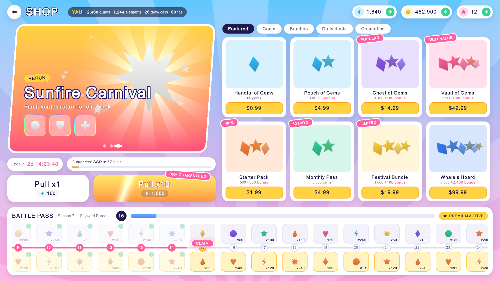
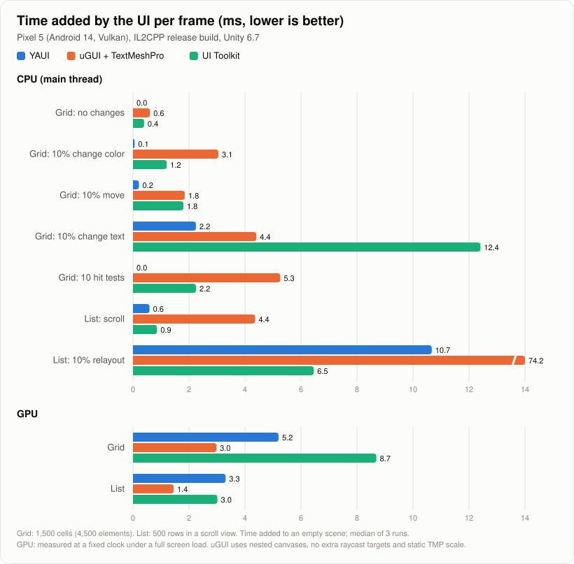

<div align="center">

<h1>YAUI</h1>

<p>
<strong>
Yet Another Unity UI: GameObject の上に構築された、<br>高速で Flexbox ベースの Unity 向け UI システム
</strong>
</p>

[](https://github.com/ruccho/YAUI/releases)

[English](README.md) | 日本語


</div>

## なぜ YAUI か

Unity の uGUI は Prefab・Animator・Inspector と組み合わせて使えますが、低速です。メッシュはメインスレッドで再構築・バッチングされ、Layout Group は重く、カスタムシェーダーを使うとバッチが切れます。UI Toolkit は高速ですが、GameObject とは別の仕組みです。

YAUI は GameObject によるオーサリングを保ったまま uGUI との互換性を捨て、モダンな UI エンジンの性能を実現します。



<table>
  <tr>
    <td width="50%">
      <a href="docs/static/img/showcase-battle-hud.png"></a><br>
      <sub><b>バトル HUD</b>: 数百個のダメージ数字、World Space のネームプレート、パーティクル、カスタムシェーダー。</sub>
    </td>
    <td width="50%">
      <a href="docs/static/img/showcase-dashboard.png"></a><br>
      <sub><b>ダッシュボード</b>: 240 行のスクロールするテーブル、チャート、操作できるコントロール。</sub>
    </td>
  </tr>
  <tr>
    <td width="50%">
      <a href="docs/static/img/showcase-inventory.png"></a><br>
      <sub><b>インベントリ</b>: 352 マスのグリッド。アイコンは動的アトラスにまとめられます。</sub>
    </td>
    <td width="50%">
      <a href="docs/static/img/showcase-shop.png"></a><br>
      <sub><b>ショップ</b>: マスクで斜めに切り抜いたバナー、グラデーション、報酬トラック。</sub>
    </td>
  </tr>
</table>

各画面には、エディタで計測したクアッド数・要素数・draw call 数を表示しています。

### 高速

ボックス・画像・グリフはすべて GPU バッファ上の Quad であり、**パネルごとに 1 ドローコール**で描かれます。角丸・ボーダー・ドロップシャドウ・SDF テキストはすべて 1 つの Uber シェーダーで描かれ、バッチを切りません。テキスト生成とレイアウトは**ワーカースレッド上のジョブ**として実行され、変更のないフレームのコストはほぼゼロです。

<picture>
  <source media="(prefers-color-scheme: dark)" srcset="docs/static/img/benchmark-dark.svg">
  
</picture>

同じ画面を YAUI、uGUI、UI Toolkit で組み、Pixel 5 で計測した結果です。ほとんどのシナリオで YAUI のメインスレッドのコストが最も小さく、GPU のコストは uGUI より大きくなります。詳しくは[ベンチマーク](https://ruccho.com/YAUI/ja/benchmarks)を参照してください。

### 高度なレイアウト

Yoga の移植版による **Flexbox** レイアウトを Burst で計算します。サイズが固定のボックスは**レイアウトの境界**となり、変更はそれが影響する部分木だけをレイアウトし直します。

### GameObject ベース

要素は GameObject 上のコンポーネントです。**Prefab・Animator・Timeline・Inspector** をいつもどおりに使えます。入力は **EventSystem** を通り、パネルは画面へのオーバーレイとしても **World Space** にも描けます。

> [!NOTE]
> YAUI は**実験的**なパッケージです。最初の安定版のリリースまでに破壊的変更が行われる可能性があります。

## 要件

- Unity 6000.3 (Unity 6.3) 以降
- Universal Render Pipeline (URP)
- Vulkan、Metal、Direct3D 11 / 12 (OpenGL ES はサポートしません)

## インストール

Package Manager を開き、**Install package from git URL...** を選んで次の URL を入力してください。

```
https://github.com/ruccho/YAUI.git?path=/Packages/com.ruccho.yaui#release
```

## ドキュメント

### マニュアルと API リファレンスは[ドキュメント](https://ruccho.com/YAUI/ja/)を参照してください。

## ライセンス

[MIT](LICENSE)。Flexbox のレイアウトエンジンは Microsoft.UI.Reactor に含まれる Yoga の C# 移植を元にしています。[Third Party Notices](Packages/com.ruccho.yaui/Third%20Party%20Notices.md) を参照してください。
